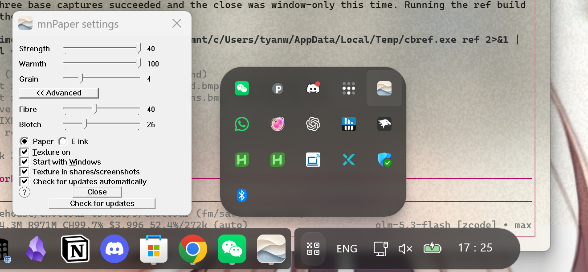

# mnPaper

A soft, generated paper texture that settles over your whole screen.
Currently Windows only. Local, lightweight and free. Download `mnPaper.exe` from the
[Releases page](https://github.com/mnsky-tyan/mnpaper/releases) and run it.




Expected usage: **paper mode** - roughly 40 MB per monitor (the texture is
kept in memory at full resolution), near-zero CPU when nothing is changing,
no GPU (it draws with plain GDI, no Direct3D). **E-ink mode** - memory
scales with your total screen area: five full-desktop buffers plus one
texture per monitor (about 120 MB on a 2880x1800 desktop, more with more or
bigger monitors), near-zero CPU when nothing is changing, one small D3D11
desktop-duplication setup on the GPU.

## Features

- Lays a warm, procedurally generated paper texture over every monitor.
- **E-ink mode** turns the entire screen into a greyscale, Kindle-style
  reader view (shades / contrast / dither).
- The texture can be shown or hidden from screenshots and screen shares
  (a checkbox; e-ink mode is always hidden from captures, because Desktop
  Duplication would otherwise capture its own output).
- Adjust parameters like strength, warmth, grain, fibre, blotch on your own.
- Keyboard: **Ctrl+Alt+P** toggles the texture, **Ctrl+Alt+E** switches
  between paper and e-ink mode (and turns the effect on if it was off).

## Requirements

- Windows 10 (version 2004+) or Windows 11, x64.

## Install and run

Download links are at the top of this page. Prefer building from source?
`git clone` this repo and follow
[Building from source](#building-from-source) - the built exe lands in the
repo root as `mnPaper.exe`.

Uninstall: quit from the tray and delete the exe. (Settings live in
`HKEY_CURRENT_USER\Software\mnPaper`; delete that key too if you want a
completely clean removal.)

Updating: mnPaper reads a tiny version file about once a day (you can turn
that off) and tells you in the tray when a new release exists. The
**Check for updates** button then offers a one-click update: it downloads
the new exe, verifies it against a published SHA-256 fingerprint, swaps it
in place of the old one and restarts. Your settings are kept. If anything
fails, nothing is changed - you can always download manually from the
[Releases page](https://github.com/mnsky-tyan/mnpaper/releases) and replace
the exe yourself (quit from the tray first).

## Privacy

- No telemetry, no analytics, no accounts.
- Outbound network is limited to updating: a version-file check about once
  a day (toggle in settings, or from the tray menu) plus whenever you press
  **Check for updates**, and the exe download itself only happens after you
  confirm the update prompt. Downloads are fetched over HTTPS and verified
  against a published fingerprint before anything is replaced. Everything
  else stays on your machine.
- Settings live in the registry key named under **Uninstall** above.

## Building from source

- Visual Studio 2022 (any edition), x64 Native Tools command prompt.
- No third-party dependencies.

```bat
git clone https://github.com/mnsky-tyan/mnpaper.git
cd mnpaper
rc /nologo mnPaper.rc
cl /nologo /O2 /W3 mnPaper.c mnPaper.res /FemnPaper.exe
```

The build produces `mnPaper.exe` in the repo root.

## Known limitations

- The texture cannot cover the secure desktop (Ctrl+Alt+Delete, UAC prompts,
  the login screen): Windows forbids drawing there by design.
- The Start menu, search and notification center run in shell z-order bands
  ordinary apps cannot enter, so they stay untextured.
- The taskbar: while it is visible - taller than the roughly 16-pixel sliver
  a parked auto-hidden taskbar keeps on screen, which stays covered like the
  rest of the desktop - the paper steps out of the way of the taskbar's own
  buttons (the Start button, the icon pill and the tray pill) so they stay
  crisp with no texturing on top of
  them; the gaps between them keep the paper, as shown in the screenshot
  above. Forcing the always-on-top paper over the taskbar instead makes
  Windows drop the taskbar's own topmost state, which is why it steps aside
  rather than covering it. Taskbars shown on secondary displays get the same
  treatment.
- The settings window keeps a compact fixed-size layout rather than scaling
  with your display DPI, so it looks small on a high-DPI screen; every
  control still fits and works.
- E-ink mode can shimmer on content-heavy screens at low shade counts.
- The exe is not code-signed yet: the first run may show a SmartScreen
  warning ("More info" -> "Run anyway").
