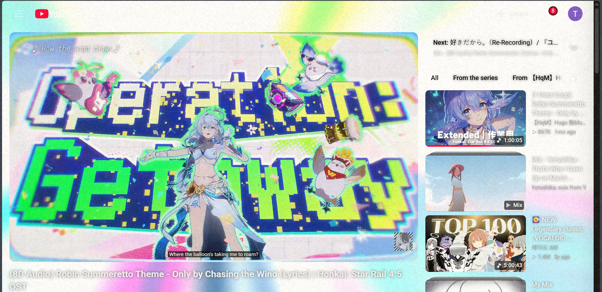
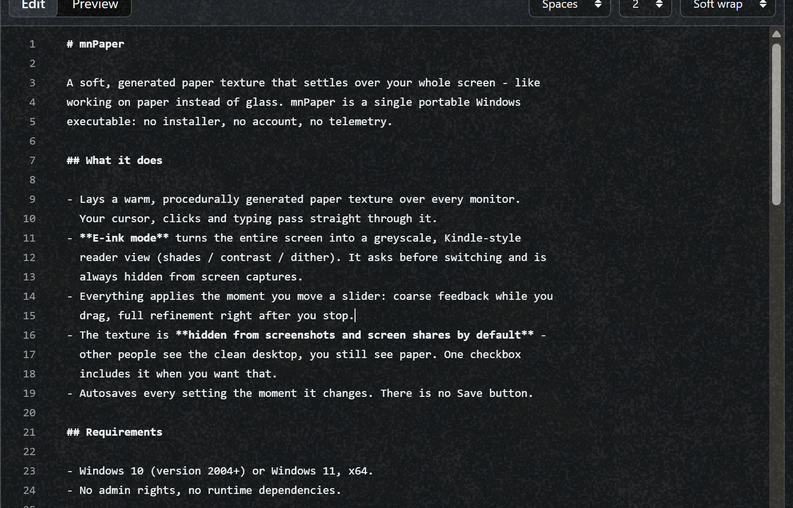
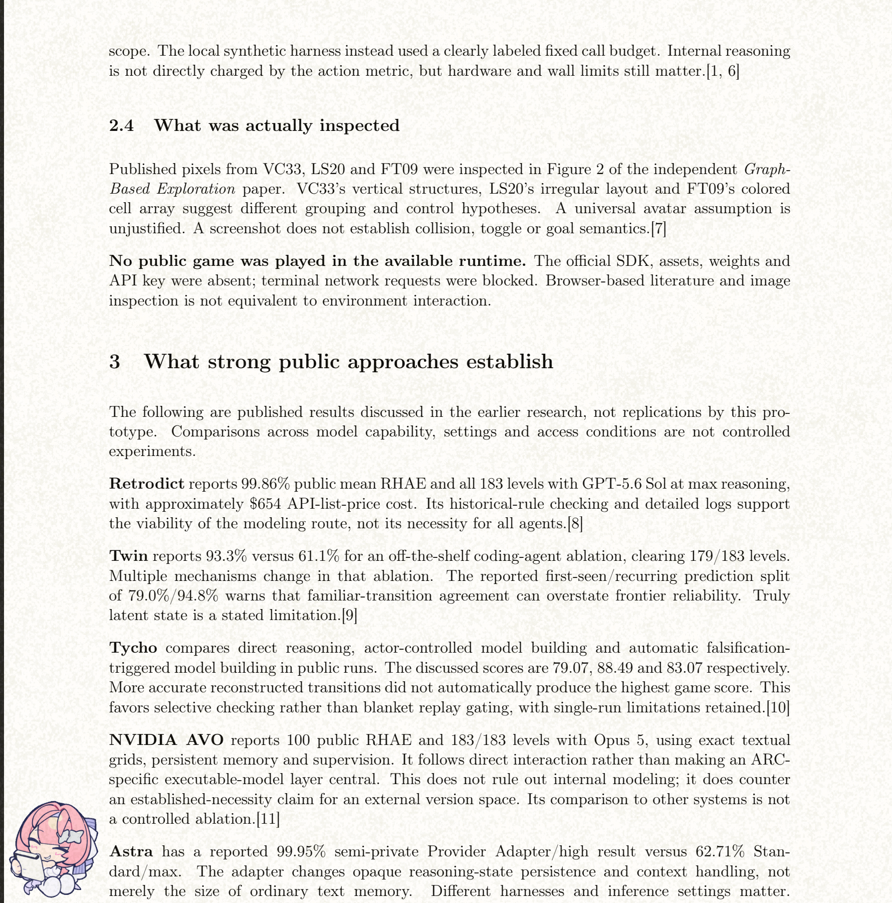

# mnPaper

A soft, generated paper texture that settles over your whole screen.
Currently Windows only. Local and free. Download `mnPaper.exe` from the
[Releases page](https://github.com/mnsky-tyan/mnpaper/releases) and run it.







Expected usage: **paper mode** - about 25-50 MB of RAM, near-zero CPU when
nothing is changing, no GPU (it draws with plain GDI, no Direct3D).
**E-ink mode** - about 25-50 MB of RAM, near-zero CPU when nothing is
changing, one small DirectX swapchain on the GPU.

## Features

- Lays a warm, procedurally generated paper texture over every monitor.
- **E-ink mode** turns the entire screen into a greyscale, Kindle-style
  reader view (shades / contrast / dither).
- The texture can be shown or hidden from screenshots and screen shares.

## Requirements

- Windows 10 (version 2004+) or Windows 11, x64.

## Install and run

Download `mnPaper.exe` from the
[Releases page](https://github.com/mnsky-tyan/mnpaper/releases) and run it.

Prefer building from source? `git clone` this repo and follow
[Building from source](#building-from-source) - the built exe lands in the
repo root as `mnPaper.exe`.

Uninstall: quit from the tray and delete the exe. (Settings live in
`HKEY_CURRENT_USER\Software\mnPaper`; delete that key too if you want a
completely clean removal.)

## Privacy

- No telemetry, no analytics, no accounts.
- Settings live in `HKEY_CURRENT_USER\Software\mnPaper`.

## Building from source

- Visual Studio 2022 (any edition), x64 Native Tools command prompt.
- No third-party dependencies.

```bat
git clone https://github.com/mnsky-tyan/mnpaper.git
cd mnpaper
rc /nologo mnPaper.rc
cl /nologo /O2 /W3 mnPaper.c mnPaper.res /FemnPaper.exe
```

The build produces `mnPaper.exe` in the repo root.

## Known limitations

- The texture cannot cover the secure desktop (Ctrl+Alt+Delete, UAC prompts,
  the login screen): Windows forbids drawing there by design.
- The Start menu, search and notification center run in shell z-order bands
  ordinary apps cannot enter, so they stay untextured.
- An auto-hidden taskbar is covered by the paper while it is parked, and
  floats above the paper when you reveal it. The revealed taskbar itself is
  not textured: mnPaper steps aside for it, because forcing the always-on-top
  paper over a revealed taskbar makes Windows drop the taskbar's own topmost
  state.
- E-ink mode can shimmer on content-heavy screens at low shade counts.
- The exe is not code-signed yet: the first run may show a SmartScreen
  warning ("More info" -> "Run anyway").
